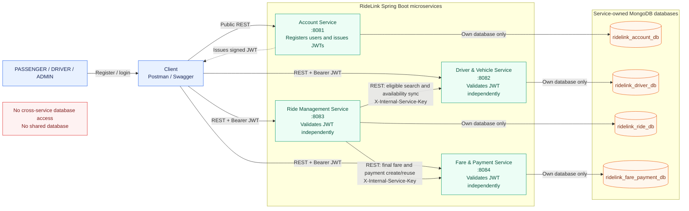

# RideLink system architecture

## Trust boundaries

- User-facing protected REST requests carry an Account Service JWT as a Bearer token.
- Driver & Vehicle, Ride Management, and Fare & Payment validate JWTs independently.
- Ride authenticates its trusted downstream calls with `X-Internal-Service-Key`.
- Database arrows are deliberately one-to-one: a service never reads another service's MongoDB database.
