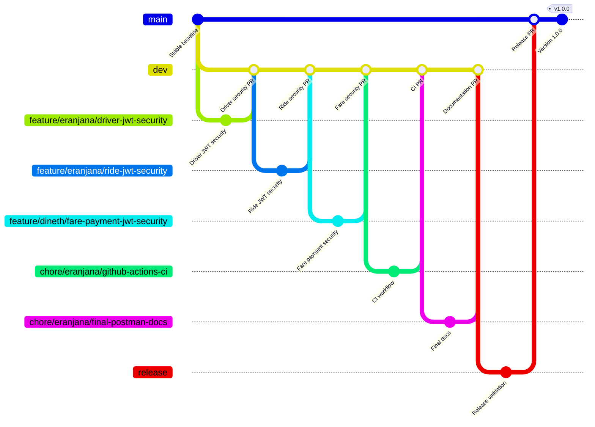

# RideLink Git branch workflow

All `feature/...`, `chore/...`, and `fix/...` branches merge into `dev` through pull requests. `dev` progresses to `release`, then `main`; the validated `main` state receives the `v1.0.0` tag. Eranjana's changes are reviewed by Dineth, and Dineth's changes are reviewed by Eranjana.
